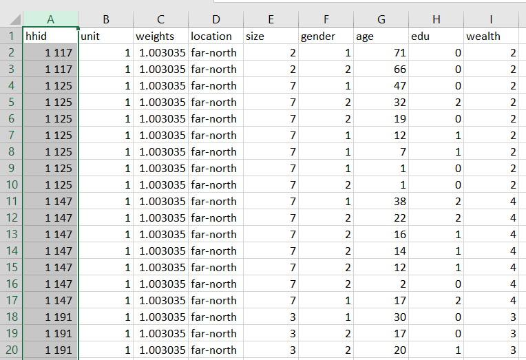
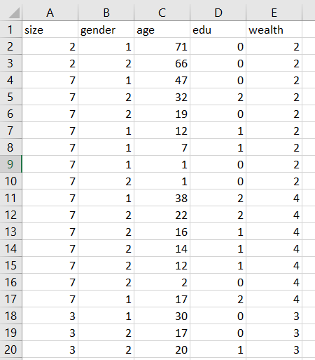
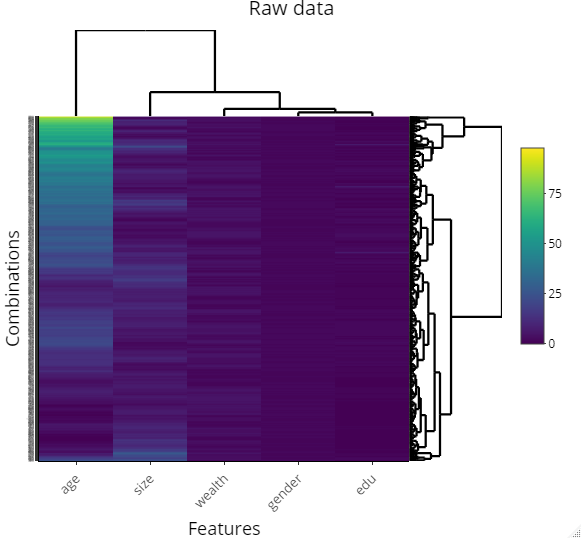
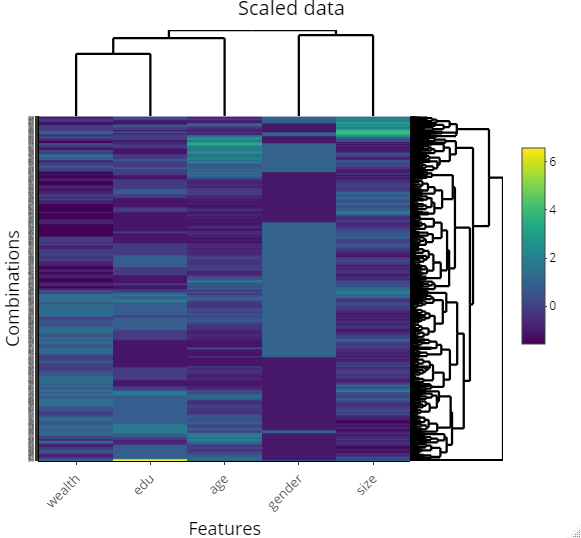
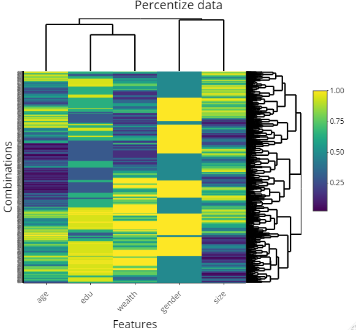
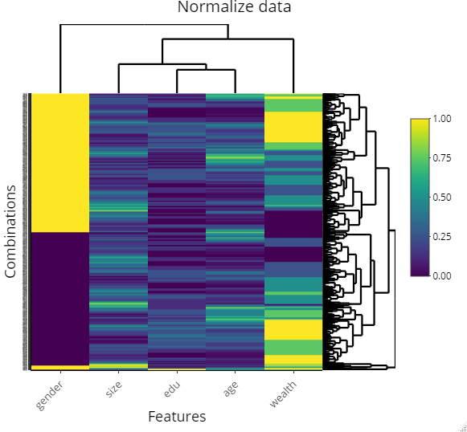

# March_10_Informal_Response
# Cameroon, South Africa

Import the households dataset for your selected country and create a data frame with a variable that describes each of the following.
household ID
unit
weights
location
size
gender
age
education
wealth

Pivot the persons columns within your households data to a long format in order to produce a similarly specified dataset that describes all persons residing within all households.

Using this data frame describing all persons standardize, normalize and percentize your variables and visualize each post transformed dataset as a heatmap that illustrates the heterogeneity of the combination of patterns.

### Raw data heatmap

### Scaled data heatmap

### Percentized data heatmap

### Normalized data heatmap

